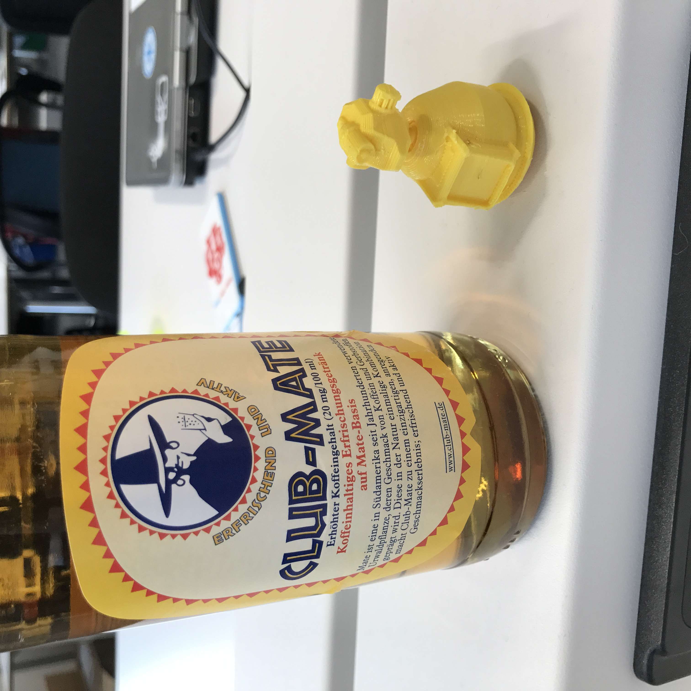

# Mate

vr-hackathlon projet

> La data en 3D tu représenteras

> De l'IoT les data viendront

> Dans le monde tu navigueras

## Simulation de capteur / actuateur

Lancer l'appication sur l'iPad, noter l'IP puis ouvrir dans un browser le fichier `client/ws.html`.

Renseigné l'IP de l'iPad puis le port, clicker sur connecté, le point rouge devrait passer au vert si la connection est réussie.

Une fois connecté, utilier les fleches haut/bas/gauche/droite pour faire bouger le robot et espace pour le faire exploser.

## Credits

### 3D design & explosions

- [Felix BARC](http://felixbarc.com)
- [Olivier AMREIN](http://www.olivieramrein.com)

### Sounds & Music

- [Marquis' MCGEE](http://www.marquismcgee.com)

### Sensors & Tea

- [Beat GERBER](http://bg.agrotec.ch)

### 3D Printing & Community Manager

- [Yuuta JORAND](https://github.com/hydrogene09)

### Development & Post-it

- [Nicolas JORAND](http://nicolas.jorand.io)
- [Jacques COUVREUR](http://inagua.ch/author/jacques/)

### Press & Media

- [Salome KURATLI](http://halle.li)